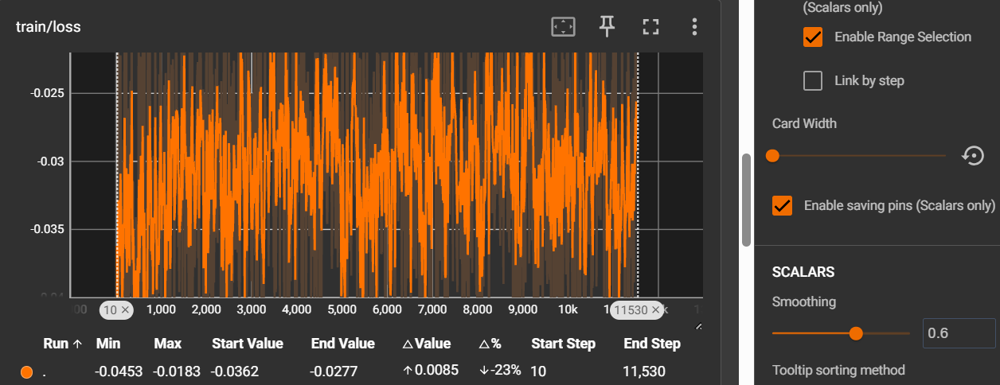
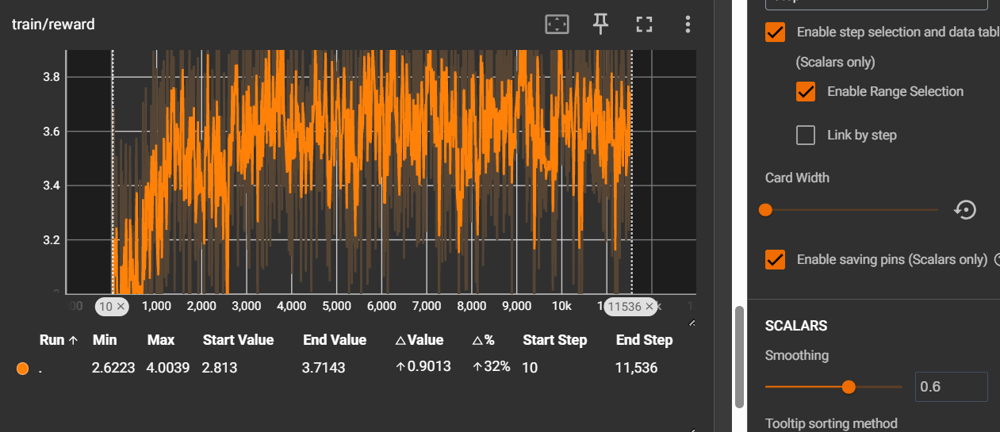
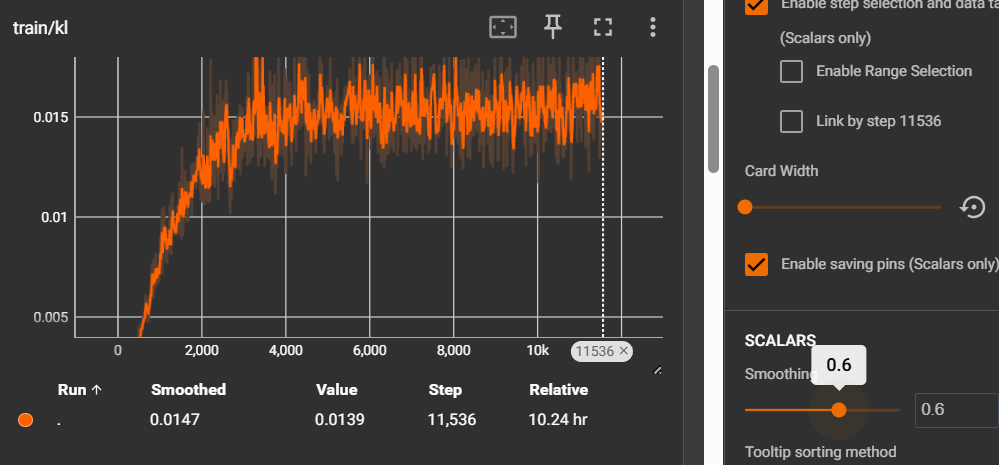

# Humor-Generation-2026.22-grpo

## 训练数据来源和说明


## SFT

### 训练数据

训练数据于pre_data/zh_humor_with_prompts.csv

|样本数量|数据格式|
|--|--|
|11536|headline:word1:word2:joke|

SFT 训练时以 prompt+joke 输入


```python
# Prompt模板
PROMPT_TEMPLATE_HEADLINE = """请根据以下新闻标题，创作一段幽默的中文文本：

标题：{headline}

幽默文本："""

PROMPT_TEMPLATE_WORDS = """请使用以下两个词语，创作一段幽默的中文文本：

词语：{word1}、{word2}

幽默文本："""
```

### 模型和训练

上一次 SFT 时没有设置EOS token,模型会不断地预测到 max_token 而不会停止，可能是导致生成乱码的一个重要原因。另外，之前的 GRPO 使用的模型太大，数据太少导致过拟合，模型崩了。所以这一次选用较小的模型 Qwen3-1.7B , SFT 时加入 EOS token。

```python
# ============ 配置 ============
MODEL_NAME = 'unsloth/Qwen3-1.7B'  # 使用Qwen3-1.7B
OUTPUT_DIR = 'model/zh_actor_sft'
DATA_FILE = '../pre_data/zh_humor_with_prompts.csv'

MAX_LENGTH = 256  # 增加长度以容纳prompt+生成
BATCH_SIZE = 4
EPOCHS = 3
LEARNING_RATE = 2e-5

# LoRA配置
LORA_R = 16
LORA_ALPHA = 32
LORA_DROPOUT = 0.05
```

## RM(Reward Model)

### 训练数据

训练数据于pre_data/train_RM_data/train_RM_data_zh.csv

|样本数量|正负样本比|数据格式|
|--|--|--|
|16422|11536:4885|headline:word1:word2:joke:label|

RM 训练时以 prompt+joke:label 输入

### 模型和训练

prompt模板于sft一致，便于后续 GRPO 时生成内容与评测内容对齐

#### 评估统计

**测试集：**

|样本数量|正负样本比|
|--|--|
|4106|2885:1221|


**测试指标：**

|准确率(acc)|精确率(P)|召回率(R)|F1分数|
|--|--|--|--|
|0.8755|0.9124|0.9102|0.9113|

## GRPO

### 训练数据

训练数据为SFT的训练数据,但只用prompt输入，不用joke作为输入。

用 TRL 的 GRPOTrainer 进行，report to Tensorboard 记录日志，便于绘图查看loss

|样本数量|数据格式|
|--|--|
|11536|headline:word1:word2|


### 模型和训练

模型使用 SFT 得到的 lora 权重与 Qwen3-1.7B 合并，作为策略模型（policy model）

```python
GRPO设计:
- Policy: SFT后的Qwen3-4B (可训练, 4-bit + LoRA)
- RM: 训练好的DeBERTa打分模型 (frozen, 用于计算reward)

Reward流程:
1. Qwen3生成 → token ids
2. Actor tokenizer解码 → 中文文本字符串
3. DeBERTa tokenizer编码 → DeBERTa的token ids
4. DeBERTa模型打分 → reward分数

# ============ 配置 ============
# GRPO训练参数
LEARNING_RATE = 1e-6
BATCH_SIZE = 16
GRADIENT_ACCUMULATION_STEPS = 1
EPOCHS = 3
LOGGING_STEPS = 10
SAVE_STEPS = 100

# GRPO特定参数
NUM_SAMPLE_GENERATIONS = 4  # 每个prompt生成的样本数（组大小）
generation_batch_size = 64  #生成批次大小 等于NUM_SAMPLE_GENERATIONS*batch_size
MAX_NEW_TOKENS = 128
TEMPERATURE = 0.8
TOP_P = 0.95

# LoRA配置
LORA_R = 16
LORA_ALPHA = 32
LORA_DROPOUT = 0.05
```

#### 奖励函数设计

本次 SFT 时加入了 EOS token 模型生成会自动停止，另外，模型缩小，数据量扩大，所以先尝试单一的奖励，奖励为RM对策略模型生成内容打出的分数。

训练完成后，我按照训练 prompt 模板测试了几条生成内容，发现没有乱码了。

&nbsp;

#### TensorBoard 绘图








